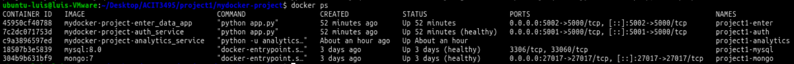
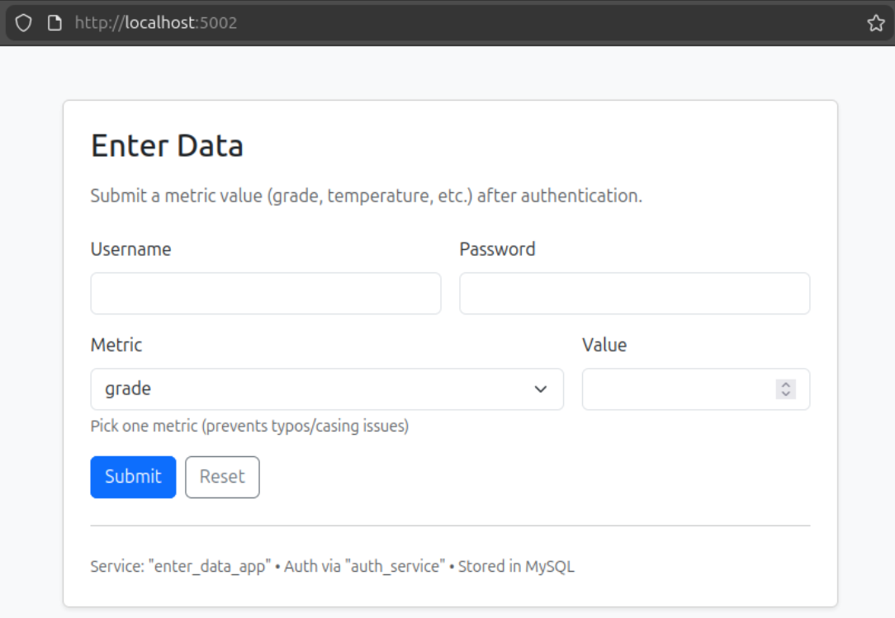
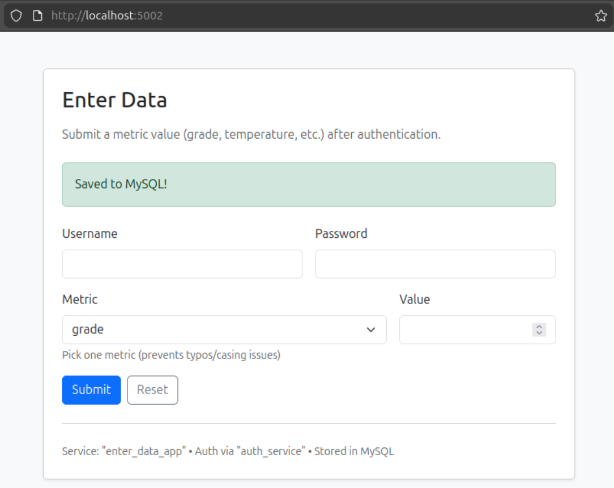
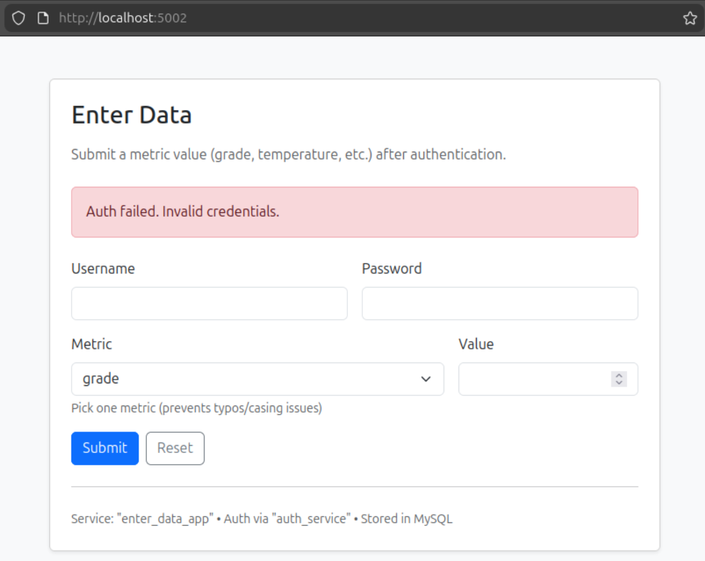
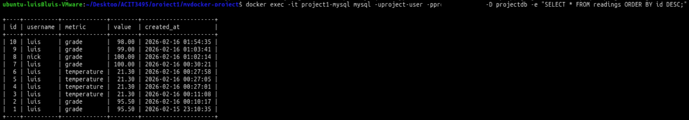
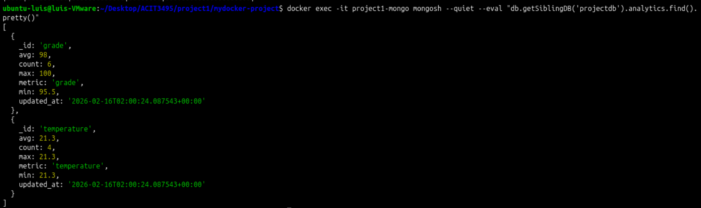
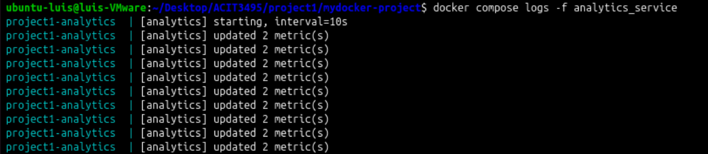
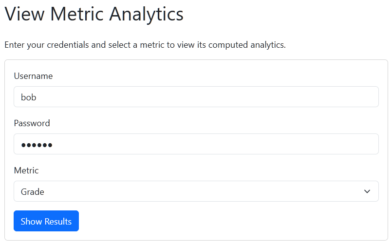
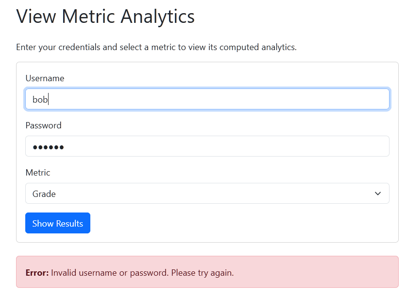
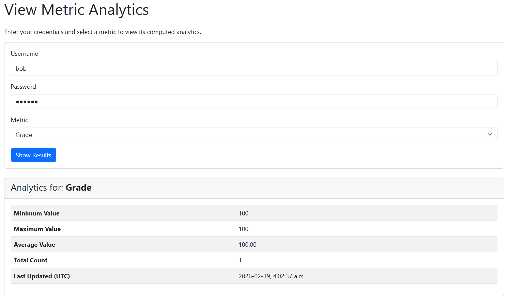

# ACIT3495 – Project 1 (Containerized Microservices Data Collection & Analytics System)

This repository implements a containerized microservices system for collecting numeric data (ex. grades, temperatures, humidity) and computing simple analytics (min/max/avg/count).

## Architecture (Current)
Services running so far:

- **MySQL DB**  
  Stores raw readings submitted by users.

- **MongoDB**  
  Stores computed analytics results per metric (one document per metric).

- **auth_service (Python/Flask)**  
  Validates user credentials via API (`POST /validate`).

- **enter_data_app (Python/Flask + Bootstrap)**  
  Web UI to submit a reading (username/password/metric/value).  
  - Calls `auth_service` to validate credentials  
  - Inserts readings into MySQL  
  - Uses dropdown metrics + server-side normalization to avoid casing issues (`grade` vs `Grade`)  
  - Uses Bootstrap alerts (green success / red error) and flash messages (disappear on refresh)

- **analytics_service (Python worker)**  
  Background service that periodically:
  - Reads readings from MySQL
  - Computes stats per metric (min/max/avg/count)
  - Writes/updates one MongoDB document per metric (Mongo `_id` = metric)

- **show_results_app (Node.js/Express + Bootstrap)**  
  Web UI to authenticate users and display analytics results from MongoDB.
---

## Repository Structure

- `auth_service/`
  - `app.py`
  - `requirements.txt`
  - `Dockerfile`

- `enter_data_app/`
  - `app.py`
  - `requirements.txt`
  - `Dockerfile`
  - `templates/index.html`

- `analytics_service/`
  - `analytics.py`
  - `requirements.txt`
  - `Dockerfile`

- `mysql/`
  - `init.sql` (schema initialization)

- `show_results_app/` (to be implemented by team member)
  - `server.js`, `package.json`, `Dockerfile`, etc.

- `docker-compose.yaml` (runs the full system)

---

## Data Model

### MySQL
Database: `projectdb`  
Table: `readings`

- `id` (auto increment)
- `username` (varchar)
- `metric` (varchar) — examples: `grade`, `temperature`, `humidity`, `pressure`
- `value` (decimal)
- `created_at` (timestamp)

### MongoDB
Database: `projectdb`  
Collection: `analytics`

One document per metric:

- `_id`: metric name (e.g., `grade`)
- `metric`: same as `_id`
- `min`, `max`, `avg`, `count`
- `updated_at` (ISO timestamp)

---

## Prerequisites
On the your machine, ensure:
- Docker Engine installed
- Docker Compose plugin installed
- Your user can run docker without sudo (optional but recommended)

Verify:
```bash
docker version
docker compose version
docker run --rm hello-world
```

---

## How to Run

From the repo root:

```bash
docker compose up -d --build
docker compose ps
```

To stop:
```bash
docker compose down
```

To fully reset (deletes DB volumes/data):
```bash
docker compose down -v
```

---

## Service Endpoints (Current)

### auth_service
- Host port: `5001`
- Health:
```bash
curl -s http://localhost:5001/health
```
- Validate credentials:
```bash
curl -s -X POST http://localhost:5001/validate \
  -H "Content-Type: application/json" \
  -d '{"username":"bob","password":"bob123"}'
```

### enter_data_app
- Host port: `5002`
- Open in browser:
- `http://localhost:5002/`

Submit:
- Username + Password
- Metric (dropdown)
- Value (numeric)

Successful submission inserts a row into MySQL.

---

## Verification / Useful Commands

### Check MySQL schema
```bash
docker exec -it project1-mysql mysql -uroot -proot-passwd -D projectdb -e "DESCRIBE readings;"
```

### View latest readings
```bash
docker exec -it project1-mysql mysql -uroot -proot-passwd -D projectdb -e \
"SELECT * FROM readings ORDER BY id DESC LIMIT 10;"
```

### View analytics documents in Mongo
```bash
docker exec -it project1-mongo mongosh --quiet --eval \
"db.getSiblingDB('projectdb').analytics.find().pretty()"
```

### View analytics_service logs (compose service name)
```bash
docker compose logs -f analytics_service
```

(Alternative using container name)
```bash
docker logs -f project1-analytics
```

---

## Notes / Design Decisions

- **MySQL ports are NOT published** by default to avoid host conflicts on port 3306.
  - Containers talk to MySQL internally over the Docker network using hostname `mysql`.
  - For debugging, use `docker exec` commands shown above.
  - If we REALLY need host access, we can map a different port (example 3307:3306) and restart.

- **Metric normalization**
  - The app normalizes metric to lowercase on the server to prevent separate stats for `Grade` vs `grade`.

- **Bootstrap UI**
  - Uses Bootstrap CDN for styling (no local CSS file required).
  - Bootstrap JS bundle is optional (only needed for interactive components like modals/navbars).

---

## Team Responsibilities
- Current implemented: DBs + auth_service + enter_data_app + analytics_service
- Remaining work:
  - Implement `show_results_app` (Node/Express) to authenticate via `auth_service` and display analytics from MongoDB
  - Finalize README additions (screenshots, diagrams, more usage examples)
  - Write technical report
  - Build presentation slides

---

## Screenshots (Evidence)

> All screenshots are stored in `./images/`

### 01 — Docker Compose Running


---

### 02 — Enter Data Web App (Form)


---

### 03 — Enter Data Success


---

### 04 — Enter Data Auth Failure


---

### 05 — MySQL Readings Table


Command Used:
```bash
docker exec -it project1-mysql mysql -uroot -proot-passwd -D projectdb -e \
"SELECT * FROM readings ORDER BY id DESC;"
```

---

### 06 — Mongo Analytics Documents


Command Used:
```bash
docker exec -it project1-mongo mongosh --quiet --eval \
"db.getSiblingDB('projectdb').analytics.find().pretty()"
```

---

### 07 — Analytics Service Logs


Command Used:
```bash
docker compose logs -f analytics_service
```

---

### 08 — Show Results App



### 09 — Show Results App (Invalid Credentials)



### 10 — Show Results App (Valid Credentials & Stats)



